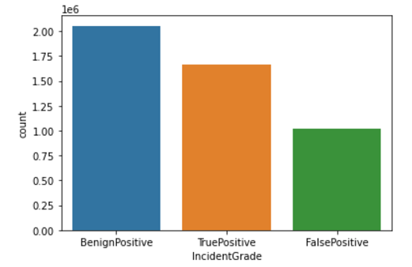

# Microsoft: Classifying Cybersecurity Incidents with Machine Learning

## Overview
This repository contains the implementation of a machine learning pipeline designed to classify cybersecurity incidents into three categories: **True Positive (TP)**, **Benign Positive (BP)**, and **False Positive (FP)**. Using the Microsoft GUIDE dataset, the project leverages advanced data preprocessing, feature engineering, and classification techniques to optimize model performance and support Security Operation Centers (SOCs) in automating incident triage.

## Key Features
- **Extensive Data Preprocessing and Feature Engineering**:
  - Null value handling and removal of irrelevant features.
  - Time-based feature extraction (day, hour, etc.) from timestamps.
  - Label encoding for categorical variables.
  - Feature correlation analysis to drop highly correlated features.

- **Machine Learning Model Training and Optimization**:
  - Baseline models: Logistic Regression and Decision Trees.
  - Advanced models: Random Forest, Gradient Boosting, XGBoost, and LightGBM.
  - Techniques to handle class imbalance: SMOTE and class-weight adjustments.
  - Hyperparameter tuning using RandomizedSearchCV.

- **Model Evaluation**:
  - Metrics: Macro-F1 score, precision, recall.
  - SHAP analysis to identify important features.
  - Comparison of models to select the best performer.

- **Deployment-Ready Solution**:
  - Final model saved using `joblib` for easy deployment.

## Business Use Cases

#### 1. Security Operation Centers (SOCs)  
Automate the triage process to prioritize critical threats efficiently.

#### 2. Incident Response Automation  
Enable systems to suggest appropriate actions for incident mitigation.

#### 3. Threat Intelligence  
Enhance detection capabilities using historical evidence and customer responses.

#### 4. Enterprise Security Management  
Reduce false positives and ensure timely addressing of true threats.

## Dataset
The Microsoft GUIDE dataset provides comprehensive telemetry data across three hierarchies: evidence, alerts, and incidents. Key highlights include:

GUIDE_train.csv (2.43 GB)
GUIDE_test.csv (1.09 GB)
[Kaggle Link to Dataset](https://www.kaggle.com/datasets/Microsoft/microsoft-security-incident-prediction)

Sample row: 

| Id | OrgId        | IncidentId | AlertId | Timestamp                | DetectorId | AlertTitle    | Category      | MitreTechniques | IncidentGrade | ActionGrouped | ActionGranular | EntityType | EvidenceRole | DeviceId | Sha256 | IpAddress  | Url | AccountSid | AccountUpn | AccountObjectId | AccountName | DeviceName | NetworkMessageId | EmailClusterId | RegistryKey | RegistryValueName | RegistryValueData | ApplicationId | ApplicationName | OAuthApplicationId | ThreatFamily | FileName | FolderPath | ResourceIdName | ResourceType | Roles | OSFamily | OSVersion | AntispamDirection | SuspicionLevel | LastVerdict | CountryCode | State | City |
|----|--------------|------------|---------|--------------------------|-------------|----------------|---------------|------------------|---------------|---------------|----------------|------------|--------------|----------|--------|------------|-----|-------------|-------------|------------------|--------------|------------|------------------|----------------|--------------|-------------------|-------------------|----------------|----------------|--------------------|--------------|----------|------------|-----------------|--------------|-------|----------|-----------|-------------------|----------------|--------------|-------------|-------|------|
| 0  | 180388628218 | 0          | 612     | 2024-06-04T06:05:15.000Z | 7           | InitialAccess  | NaN           | TruePositive      | NaN           | NaN           | Ip             | Related      | 98799      | 138268 | 27         | 160396 | 441377      | 673934       | 425863          | 453297       | 153085     | 529644           | NaN            | 1631         | 635               | 860               | 2251           | 3421           | 881                | NaN          | 289573   | 117668     | 3586            | NaN          | NaN   | 5        | 66        | NaN               | NaN            | 31           | 6           | 3     |

- Volume: Contains over 13 million pieces of evidence.
- Annotations: Includes more than 1 million incidents with triage labels and 26,000 incidents labeled with remediation actions.
- Telemetry: Drawn from 6,100+ organizations, covering 441 techniques from the MITRE ATT&CK framework.
- Partitioning: Split into 70% training data and 30% testing data, maintaining stratified representation across triage grades and identifiers.

The dataset has been processed into training and testing sets (`traindata_processed.csv` and `testdata_processed.csv`), which form the backbone of this analysis.


## Project Workflow

### 1. **Data Preprocessing**
- Removed columns with >50% missing values.
- Engineered features like `Hour`, `Day`, and `Time` from timestamps.
- Encoded categorical features using `LabelEncoder`.
- Handled missing and duplicate values, ensuring clean data.
  
---

### 2. **Exploratory Data Analysis (EDA)**
- Visualized incident distributions across `Hour`, `Day`,`month` and `Category`.
  
  
  
  
  
- Identified significant class imbalance in target labels (`TP`, `BP`, `FP`).
  

- Co-relation heatmap to understand co-linearity among the features
  
---

### 3. **Model Training and Evaluation**
- **Baseline Models**: Logistic Regression and Decision Tree for initial benchmarks.
- **Advanced Models**: Random Forest, Gradient Boosting, XGBoost, and LightGBM.
 
  
- Addressed class imbalance with **SMOTE**, improving F1-scores.
- Selected **XGBoost** with the top 11 features for final evaluation.

  

---

### 4. **Hyperparameter Tuning**
- Optimized `XGBoost` hyperparameters using **RandomizedSearchCV**.
- Tuned parameters included `max_depth`, `learning_rate`, and `n_estimators`.

  

---

### 5. **Feature Importance**
- Identified top features with **SHAP**, including `OrgId`, `IncidentId`, `DetectorId`, and more.
- Used these features to improve computational efficiency and model accuracy.

  

---

### 6. **Final Evaluation**
- Tested the final model on unseen data, achieving high **Macro-F1 Score**.
- Delivered a balanced and generalizable model for real-world applications.

  


## Results
- **Best Model**: XXGBoost with hyperparameter tuning and without SMOTE.
- **Macro-F1 Score**:
  - Validation Set: **0.91**
  - Test Set: **0.90**
- **Feature Importance**:
  - Top features like `OrgId`, `IncidentId`,`alertTitle` and `DetectorId` significantly influenced predictions.
- **Model Performance**:
  - Balanced precision and recall for all three classes (`TP`, `BP`, `FP`).
- **Top Features**: Insights from SHAP analysis enabled computational efficiency and improved results.
---

## Technologies Used

### Programming Languages
- Python

### Libraries
- Data Processing: `pandas`, `numpy`
- Visualization: `matplotlib`, `seaborn`
- Machine Learning: 
  - `scikit-learn` (Logistic Regression, Decision Trees, Random Forest)
  - `XGBoost`
  - `LightGBM`
  - `imbalanced-learn` (SMOTE)
- Feature Analysis: `SHAP`

### Dataset
- Microsoft GUIDE Dataset (processed into `traindata_processed.csv` and `testdata_processed.csv`)

### Additional Tools
- Model Saving: `joblib`


## How to Run

1. Clone the repository:
   ```bash
   git clone <repository_url>
   cd <repository_directory>

 ## Acknowledgments
- Microsoft for providing the GUIDE dataset.
- Open-source contributors of libraries and tools used in this project.
- The data science and cybersecurity communities for inspiration and knowledge.

